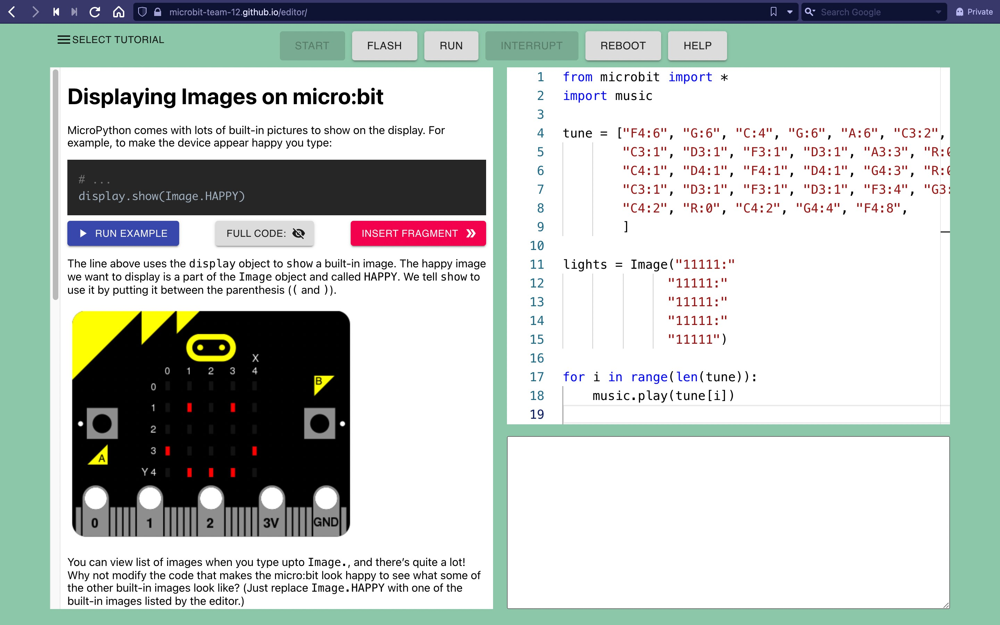
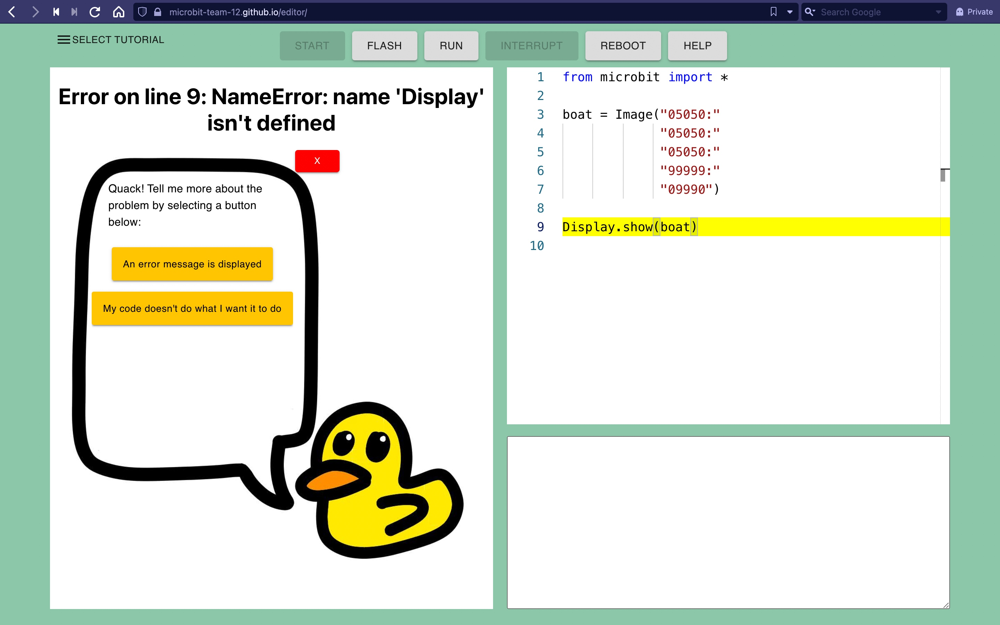
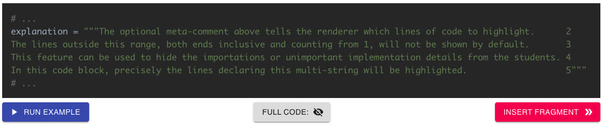

# Team 12: Micro:bit Python Editor
Award winning!

## Gallery






## Using the editor
* Online: [https://microbit-team-12.github.io/editor/](https://microbit-team-12.github.io/editor/)
* Locally (requires `git` and a Node package manager):
    ```sh
    git clone https://github.com/Microbit-Team-12/editor.git
    cd editor/
    yarn install
    yarn start
    ```

## Adding a tutorial
The demo includes 4 tutorials:
* Python Language Features
* Python Errors
* Displaying Images on micro:bit
* Playing sounds on micro:bit

To add a new tutorial, first you need to write it in markdown.
The current renderer supports the basic syntax but not HTML, 
and it has additional support for python code blocks.
For example,
```
~~~py
# LINES 2-5
explanation = """The optional meta-comment above tells the renderer which lines of code to highlight.      2
The lines outside this range, both ends inclusive and counting from 1, will not be shown by default.       3
This feature can be used to hide the importations or unimportant implementation details from the students. 4
In this code block, precisely the lines declaring this multi-string will be highlighted.                   5""" 

print(explanation)
print("Did you know you could use ~~~ instead of ```")?

~~~
```
will turn into


Finally, you need to

1. Move the markdown file to `public/tutorials`
2. Append the information about the tutorial to the list in `src/resources/tutorial_list.ts`

so that the application actually includes the tutorial you wrote.

## Documentations
* Code documentation: `docs/` -- possibly use `python3 -m http.server`
* Project documentation for the customer: [Customer Documentation.pdf](https://github.com/Microbit-Team-12/editor/blob/master/Customer%20Documentation.pdf)
* Script for manual behavioural testing: [Testing Table.pdf](https://github.com/Microbit-Team-12/editor/blob/master/Testing%20Table.pdf) 
